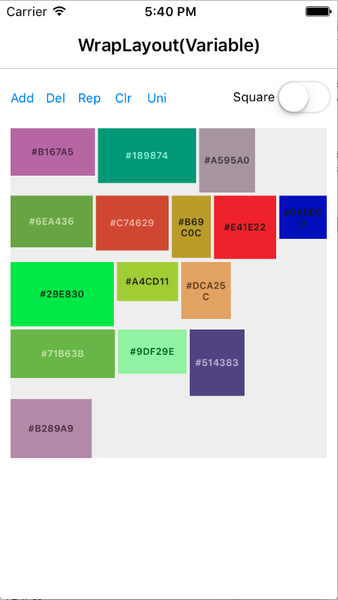
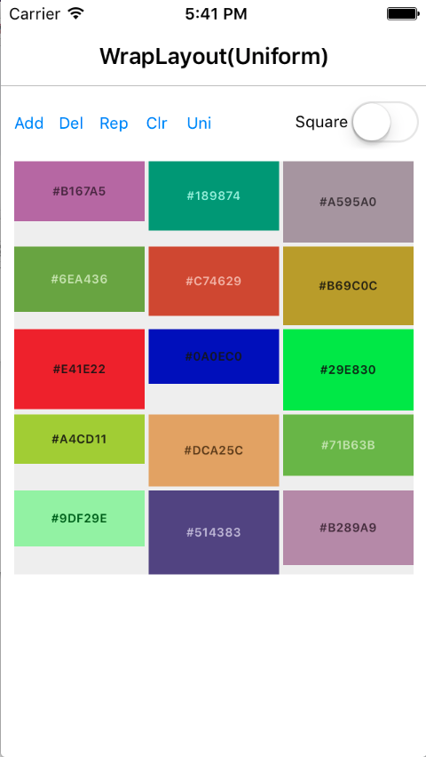
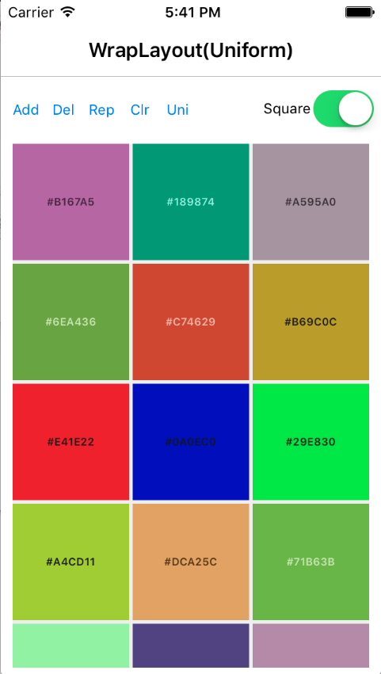

# AiForms.Layouts for NET MAUI

This is a collection of NET MAUI custom layouts

English | [日本語](README.ja.md)

## Referenced source code

* https://forums.xamarin.com/discussion/comment/57486/#Comment_57486
* https://forums.xamarin.com/discussion/21635/xforms-needs-an-itemscontrol/p2
* https://github.com/hartez/CustomLayoutExamples

## Features

* [WrapLayout](#wraplayout)
* [FitLayout](#fitlayout)



## Demo

https://twitter.com/muak_x/status/830061279330996224

## Nuget Installation

[https://www.nuget.org/packages/AiForms.Maui.Layouts/](https://www.nuget.org/packages/AiForms.Maui.Layouts/)

```bash
Install-Package AiForms.Maui.Layouts
```


## WrapLayout

This Layout performs wrapping on the boundaries.

### Parameters

* Spacing
    * added between elements
* UniformColumns
    * number for uniform child width (default 0)
    * If it is 0, child elements use their own width.
    * If it is more than 0, a child width will be width which divide parent width by this number.
* IsSquare
    * If it is true, it make item height equal to item width when UniformColumns > 0 (default false)

### How to write with Xaml

```xml
<ContentPage
		xmlns="http://schemas.microsoft.com/dotnet/2021/maui"
		xmlns:x="http://schemas.microsoft.com/winfx/2009/xaml"
		xmlns:l="clr-namespace:AiForms.Maui.Layouts;assembly=AiForms.Maui.Layouts"
		x:Class="Sample.Views.MainPage">

    <l:WrapLayout Spacing="4" UniformColumns="3" IsSquare="true">
    	<BoxView Color="Red" />
        <BoxView Color="Blue" />
        <BoxView Color="Green" />
        <BoxView Color="Black" />
        <BoxView Color="Yellow" />
    </l:WrapLayout>

</ContentPage>
```

## FitLayout

This Layout automatically scales content to fit within the parent container when it overflows.

### Parameters

* Orientation
    * Direction to fit the content (Vertical or Horizontal)
    * Default: Vertical
    * Vertical
        * When content height exceeds container height, it scales down to 100% minus ScaleMargin.
    * Horizontal
        * When content width exceeds container width, it scales down to 100% minus ScaleMargin.
* EstimatedHeight
    * Expected original height of the content (used when Orientation is Vertical)
    * If not set (-1), content height is measured without constraints.
    * For example, if you specify 600, it assumes a height of 600 for measurement before scaling.
    * Only effective when Orientation: Vertical.
    * Default: -1
* EstimatedWidth
    * Expected original width of the content (used when Orientation is Horizontal)
    * If not set (-1), content width is measured without constraints.
    * For example, if you specify 300, it assumes a width of 300 for measurement before scaling.
        * This is useful when considering text wrapping and similar factors.
    * Only effective when Orientation: Horizontal.
    * Default: -1
* ScaleMargin
    * Margin for scaling to provide extra space when content overflows
    * Value represents the margin ratio (e.g., 0.05 = 5% margin)
    * For example, if 0.05 is specified, it scales down to 95% of the parent content.
    * Default: 0 (0%)

### How to write with Xaml

```xml
<ContentPage
		xmlns="http://schemas.microsoft.com/dotnet/2021/maui"
		xmlns:x="http://schemas.microsoft.com/winfx/2009/xaml"
		xmlns:f="clr-namespace:AiForms.Maui.Layouts;assembly=AiForms.Maui.Layouts"
		x:Class="Sample.Views.MainPage">

    <!-- Basic vertical fitting example -->
    <f:FitLayout Orientation="Vertical" EstimatedHeight="800" ScaleMargin="0.05">
        <VerticalStackLayout>
            <Label Text="This content will be scaled to fit vertically" />
            <BoxView Color="Red" HeightRequest="500" />
            <BoxView Color="Blue" HeightRequest="300" />
        </VerticalStackLayout>
    </f:FitLayout>    

    <!-- Basic horizontal fitting example -->
    <f:FitLayout Orientation="Horizontal" EstimatedWidth="800" ScaleMargin="0.05">
        <HorizontalStackLayout>
            <Label Text="This content will be scaled to fit vertically" />
            <BoxView Color="Red" WidthRequest="500" />
            <BoxView Color="Blue" WidthRequest="300" />
        </HorizontalStackLayout>
    </f:FitLayout> 
</ContentPage>
```

## License

MIT Licensed.
